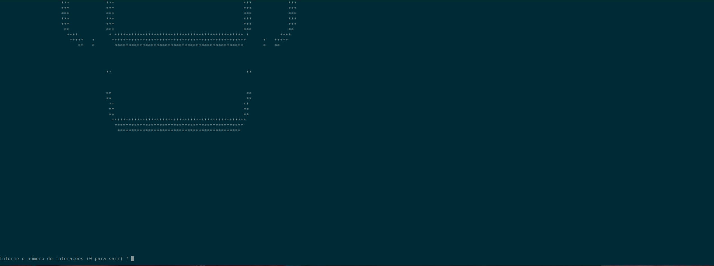

# Jogo da vida de Conway
Projeto em c++ do jogo da vida de conway

Para a compilação do projeto é necessário ter o o sdk do fabricante
caso seja nVidia baixar o nVidia Cuda e assim por diante,
é necessário ter o OpenCL

**Requisitos**

[Biblioteca pnm](https://github.com/ToruNiina/pnm)

[NVIDIA Cuda](https://developer.nvidia.com/cuda-downloads)

é mais simples a configuração e utilização no ambiente Linux

**comando de compilação**

g++ -o game JogoDaVida.cpp -std=c++0x -lOpenCL

Nesta parte informamos o número de interações que o código vai rodar

Nesta imagem aqui informamos 10 iterações

O código gera tanto no terminal como também salva a imagem na pasta

