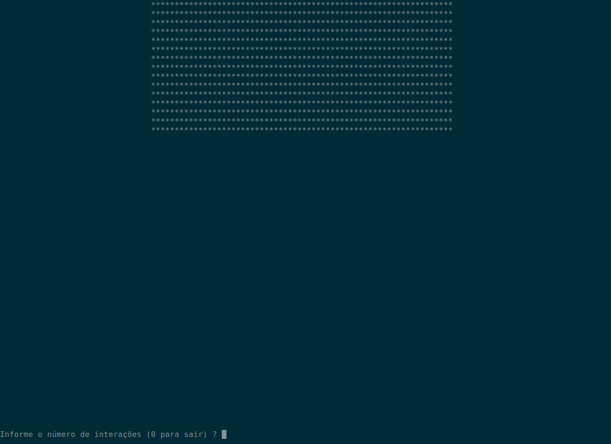

# jogo-da-vida-conway
Projeto em c++ do jogo da vida de conway

Para a compilação do projeto é necessário ter o o sdk do fabricante
caso seja nVidia baixar o nVidia Cuda e assim por diante,
é necessário ter o OpenCL

Requisitos

[Biblioteca pnm para leitura de imagens](https://github.com/ToruNiina/pnm)

é mais simples a configuração e utilização no ambiente Linux

comando de compilação

g++ -o game JogoDaVida.cpp -std=c++0x -lOpenCL

